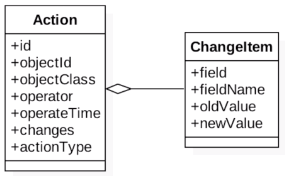

## AOP 简介
1. 是一种编程范式，不是编程语言
2. 解决特定问题，不是解决所有问题
3. 是 OOP 的补充，不是替代
---
## AOP 的初衷
- DRY: Don't Repeat Yourself
- SoC: Separation of Concerns
    - 水平分离：展示层 → 服务层 → 持久层
    - 垂直分离：模块划分（订单、库存等）
    - 切面分离：分离功能性需求与非功能性需求
---
## AOP 的好处
- 集中处理某一关注点/横切逻辑
- 可以很方便地添加/删除关注点
- 侵入性少，增强代码可读性及可维护性
---
## AOP 应用场景
- 权限控制：@PreAuthorize
- 缓存控制：@Cacheable
- 事务控制：@Transactional
- 审计日志
- 性能监控
- 分布式追踪
- 异常处理
---
## AOP 基本概念
|      |               |                                                                               |
|:-----|:--------------|:------------------------------------------------------------------------------|
| 横切   | cross-cutting | 与对象核心功能无关的公共行为                                                                |
| 关注点  | concern       | 一块我们感兴趣的区域                                                                    |
| 切面   | Aspect        | 横切面对象，对横切关注点的抽象 (@Aspect 注释的类)                                                |
| 连接点  | JoinPoint     | 程序执行过程中要拦截的点，可以是方法、字段和构造器，Spring AOP 连接点只能是方法                                 |
| 通知   | advice        | 在连接点的具体行为  ①前置@Before ②后置@After ③异常@AfterThrowing ④最终@AfterReturing ⑤环绕Around |
| 切入点  | Pointcut      | 匹配连接点  @Pointcut                                                              |
| 目标对象 | target        | 代理的目标对象                                                                       |
| 织入   | weave         | 将切面应用到目标对象并导致代理对象创建的过程                                                        |
| 引入   | introduction  | 为类动态地添加一些方法或字段                                                                |
---
## AspectJ 注解
- @Aspect
- @Pointcut
- @Advice
    - @Before: 前置通知
    - @After(finally): 后置通知，方法执行完之后
    - @AfterReturning: 返回通知，成功执行之后
    - @AfterThrowing: 异常通知，抛出异常之后
    - @Around: 环绕通知
---
## Pointcut Expression
- designators
    - 匹配方法：execution()
    ```
    格式：? 表示可省略
    execution(
        modifier-pattern?
        ret-type-pattern
        declaring-type-pattern?
        name-pattern(param-pattern)
        throws-pattern?
    )
    ```
    - 匹配注解：@target(), @args(), @within(), @annotation()
    - 匹配包/类型：within()
    - 匹配对象：this(), target(), bean()
    - 匹配参数：args(), execution()
- wildcards
    - \*: 匹配任意数量的字符
    - \+: 匹配指定类及其子类
    - ..: 一般用于匹配任意数的子包或参数
- operators
    - &&
    - ||
    - !
---
## Spring AOP 实现原理
### 织入时机
1. Aspect：编译时织入，静态代理
2. AspectJ 5+：类加载时织入，静态代理
3. Spring AOP：运行时织入，动态代理
    - JDK：基于接口，Spring 默认使用
        - 由于接口不能有 private 方法，所以无法对 private 方法进行代理
    - CGLib：Code Generation Library，基于继承
        - 无法对 static/final 类、private/final 方法 进行代理
### Spring 如何选择动态代理模式
- @see DefaultAopProxyFactory#createAopProxy(AdvisedSupport)
- 目标对象实现了至少一个接口，使用 JDK 动态代理
- 目标对象没有实现任何接口，使用 CGLib 动态代理
- 目标对象实现了至少一个接口，但强制使用 CGLib 代理，则使用 CGLib 代理
```java
@SpringBootApplication
// 强制使用 CGLib 代理
@EnableAspectAutoProxy(proxyTargetClass = true)
public class AopDemoApplication() { }
```
### AOP 如何链式调用


---
## 实战
1. 实战案例背景/目标
    - 商家产品管理系统
    - 记录产品修改的操作记录
    - 什么人在什么时间修改了哪些产品的哪些字段修改为什么值
2. 实现思路
    - 利用 aspect 去拦截增删改方法
    - 利用反射获取对象的新旧值
    - 利用 @Around 去记录操作记录
3. 领域模型/



---
## 使用 SpringAop 的注意事项
- 不宜把重要的业务逻辑放到 AOP 中处理
- 无法拦截 static/final/private 方法
- 无法拦截内部方法调用
---
